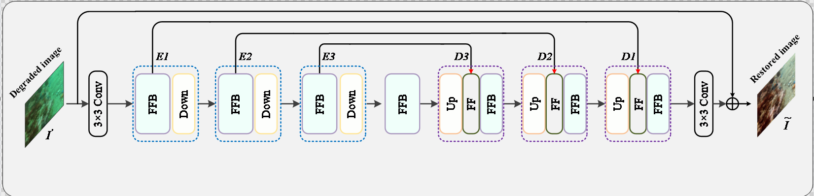
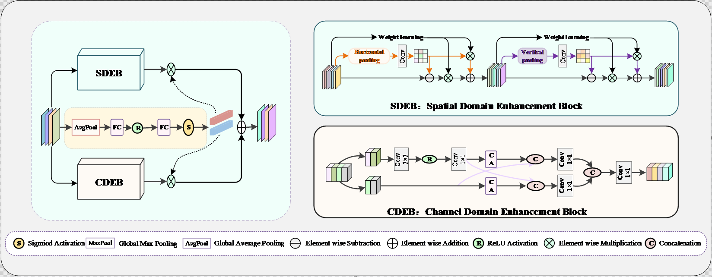
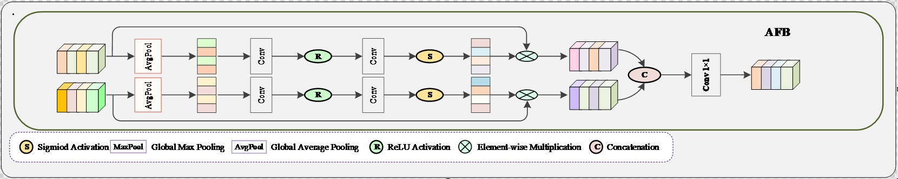

## Requirements
Requirements are given below.

```text
Python 3.8
PyTorch 1.7.1+cu110
torchvision 0.8.2+cu110
torchaudio 0.7.2
tensorboard
scikit-image
lpips
torch-fidelity
pytorch-msssim
Pillow
pandas
tqdm
opencv-python
```

## Method Overview

The overall framework of the proposed network is shown below. The model follows an encoder-decoder architecture for underwater image enhancement. It first extracts shallow features from the input image, then enhances features through several Feature Enhancement Blocks (FEBs), and finally reconstructs the enhanced image through the decoder. Multi-scale inputs and residual learning are used to improve structural preservation and color restoration.

<!-- Replace the image path with your own figure path -->


### Dual-Domain Enhancement Mechanism

The core unit of the network is the Feature Enhancement Block (FEB), which contains two complementary branches: the Spatial Domain Enhancement Block (SDEB) and the Channel Domain Enhancement Block (CDEB). SDEB focuses on spatial structure, edge, and texture enhancement, while CDEB models channel-wise feature dependencies to improve color consistency and semantic representation. The two branches are adaptively fused to obtain enhanced features.



### Attention Fusion Block

The Attention Fusion Block (AFB) is used for feature interaction between different stages of the network. It applies channel attention to different input features and then fuses them through concatenation and convolution. In the implementation, AFB is mainly used to combine backbone features with auxiliary multi-scale features, such as features generated by the Structure Compensation Module (SCM).



### Adaptive Feature Fusion

The Adaptive Feature Fusion (AFF) module is used in the decoding stage to aggregate features from different scales. It concatenates multi-scale feature maps and then uses convolution layers to compress and reconstruct the fused representation. This helps the decoder recover detailed textures while maintaining global color and structural consistency.


## Implementation Details

The model is implemented with PyTorch 1.7.1 and trained on a single NVIDIA GPU. During training, the input images are cropped or resized to 256 × 256. The batch size is set to 1 due to the multi-scale structure and GPU memory cost.

```text
Optimizer: Adam
Initial learning rate: 1e-4
Adam beta1: 0.9
Adam beta2: 0.999
Batch size: 1
Training epochs: 1000
Input size: 256 × 256
Dropout: 0.1
LR scheduler: MultiStepLR
Milestones: 500, 1000
Gamma: 0.5
```

Random cropping, horizontal flipping, and normalization are used for data augmentation. The training objective consists of a content reconstruction loss and a frequency-domain consistency loss.


## Datasets 
```
UIEDB
├── train
│   ├── input      # underwater images
│   │   ├── xxxx.png
│   │   └── ......
│   └── target     # reference images
│       ├── xxxx.png
│       └── ......
└── test
    ├── input      # underwater images
    │   ├── xxxx.png
    │   └── ......
    └── target     # reference images
        ├── xxxx.png
        └── ......

```


## Training
```bash
python train_water_LSUI.py
```


## Testing
```bash
python test_water_LSUI.py
```
